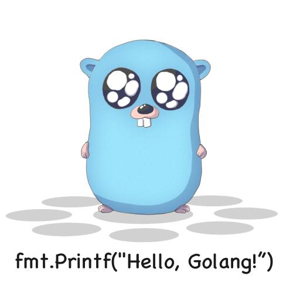
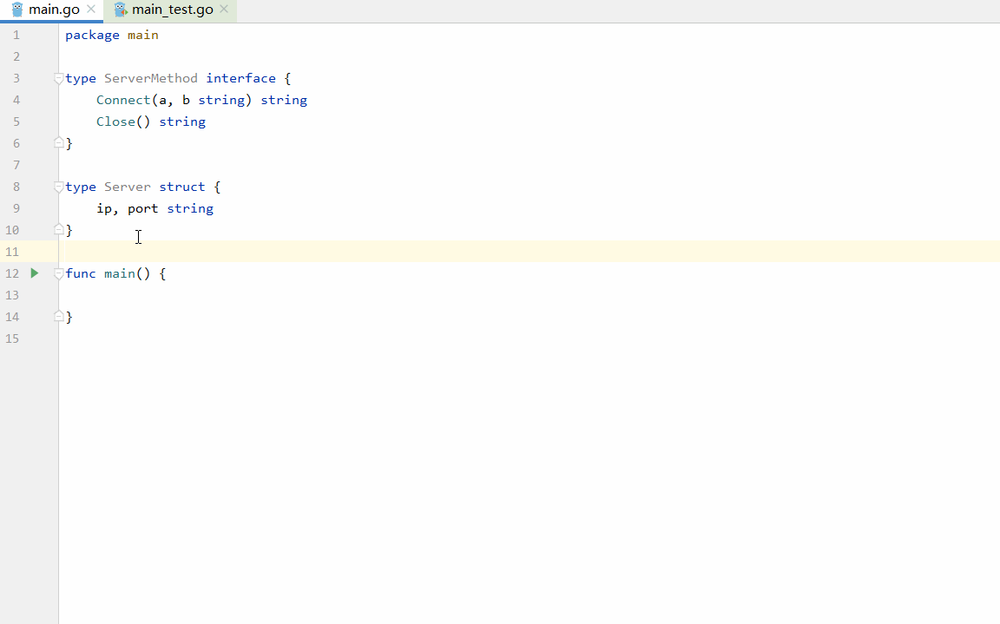
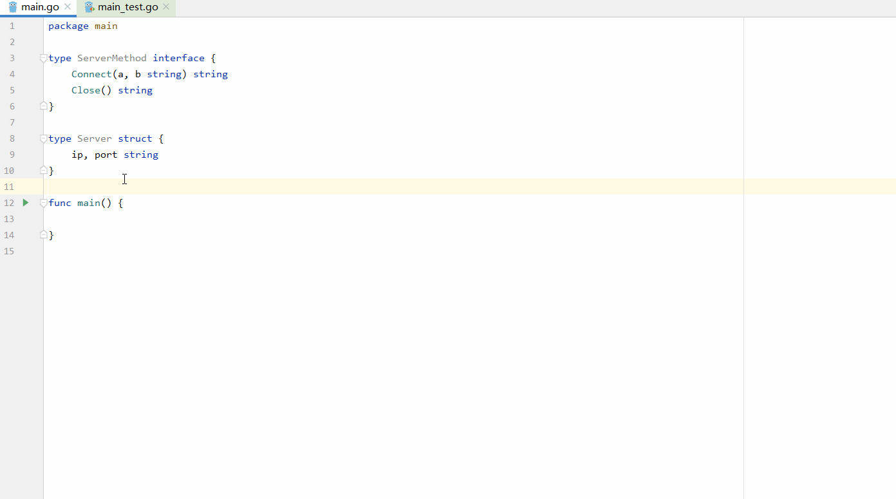
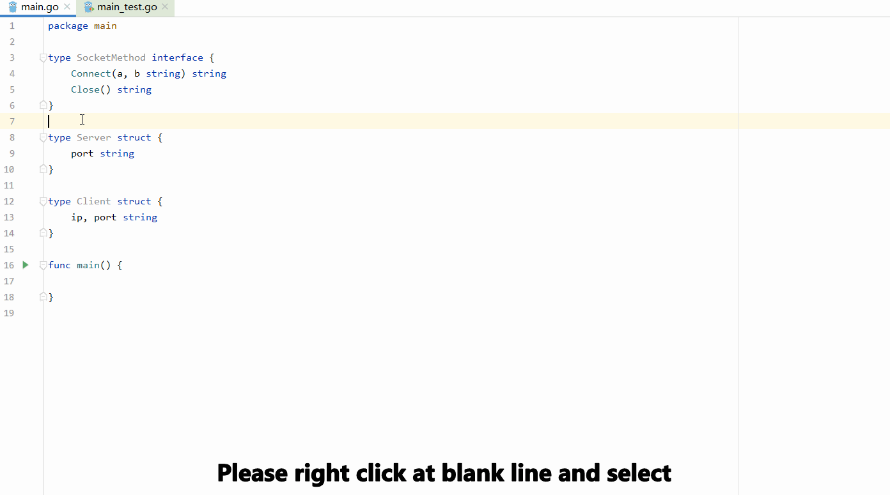
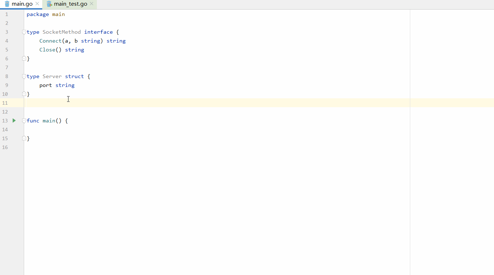

# Go Design Pattern Generator

[**点击我查看中文版(含有开发经验总结)**](./README.zn.md)

**This is a plug-in designed for developers of `Golang`. It is mainly used to quickly generate relevant design pattern code according to the existing structure or interface in the project, so as to improve development efficiency.**

At present, we have completed the template design of the most common design patterns in the development, and more design pattern templates will be designed gradually. There are some completed design templates,as follow:
- **Creation Mode**
  - [x] Singleton Mode(Thread Safe/UnSafe)
  - [x] Builder Mode
  - [x] Factory Mode
- **Structural Mode**
  - [x] Proxy Mode
- **Behavioral Model**
  - To be continue...

Because the design pattern in the `J2EE` pattern focuses on the presentation layer, relies on business logic, and the content changes greatly, this type of design pattern code generation is not considered temporarily.

# Code Generation Principle
When using this plug-in, code generation depends on the following principles:
- Do not overwrite the original file code content
- Do not modify the original project file structure
- The existing function or variable name is not checked during code generation to avoid unpredictable problems
  > The main reason for this is to avoid duplication of function or variable names in the original project with the code to be generated. If the original function is checked and filtered, it may cause hard to find logic errors in the newly generated code. By using the feature that go does not allow overloading, the editor can issue a warning and the user can decide how to adjust the code structure
# Usage
**Right click the design pattern you want to generate in the edit area to complete the code generation**
> Tip:All of the following templates will be automatically formatted after they are generated, as well as the automatic import of reference modules

## Singleton Mode
### Thread Safe

After the template is generated, you can edit and modify the variable name directly, as shown in the figure above:

### Thread UnSafe

## Builder Mode

After selecting the builder mode, you need to specify which fields on the structure need to be listed in the builder option.

## Factory Mode

Note: in factory mode, you need to select at least two structure objects to complete code generation, so you need to **right-click the blank line**, press and hold `Shift` in the pop-up structure selection box to select at least two objects, and press enter to select the interface to be implemented to complete code generation.

## Proxy Mode

It should be noted that the code generated by this design pattern contains errors by default. The purpose is for the editor to issue a warning to remind the user to decide what data content needs to be returned.
