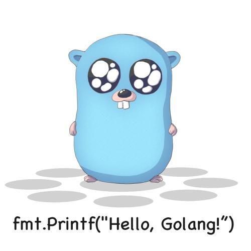
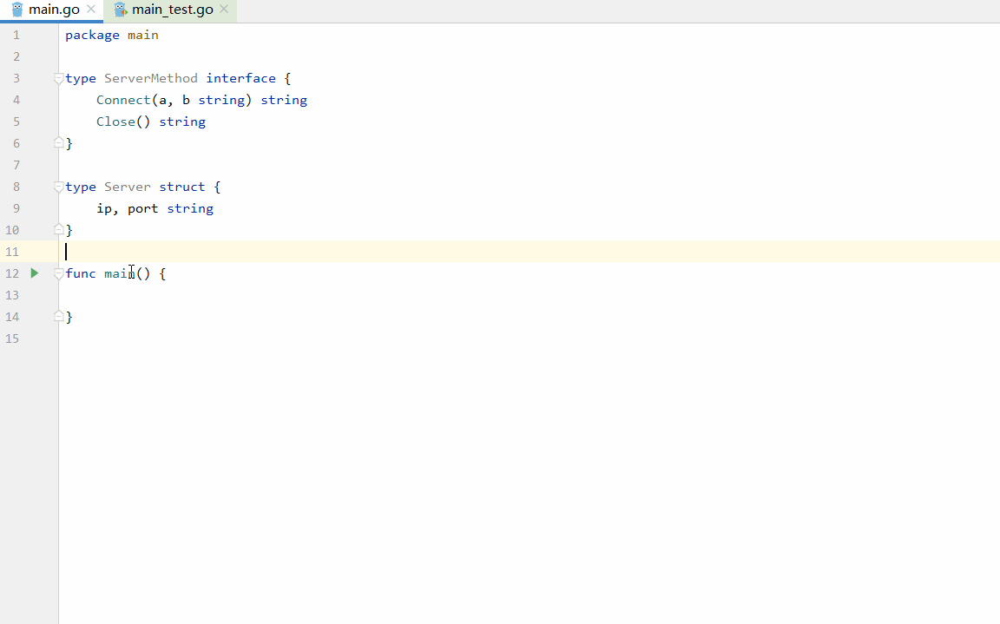

# Go Design Pattern Generator


**这是一款为`GoLang`开发人员设计的插件，主要是用于依据项目中已存在的结构体或接口快速生成相关设计模式代码，提高开发效率。**

**其次，在IDE市场或则官网SDK中对Go系列的插件开发描述介绍甚少。而本项目是作者阅读官方SDK反汇编后的代码开发而来，尽可能调用官方的API，也可以起到一些参考性的作用。后文将附上个人开发过程中的一些经验总结。**

目前已经完成了开发中最常见的几种设计模式的模板设计，更多的设计模式模板将逐渐设计完成。已经完成设计的模板有:
- **创建型模式**
  - [x] 单例模式(线程安全版/单线程版)
  - [x] 建造者模式
  - [x] 工厂模式
- **结构型模式**
  - [x] 代理模式
- **行为型模式**
  - 待设计...

由于`J2EE`模式中的设计模式关注于表现层，依赖业务逻辑，内容变化比较大，所以暂时不考虑这类型的设计模式代码生成。

# 模板代码生成原则
在使用本插件时，依赖于以下几个原则进行代码生成:
- 不对原有文件代码内容进行覆盖
- 不修改原有项目文件结构
- 代码生成过程中不对已有函数或变量名进行检查，以免出现不可预测问题
  > 这样做的主要原因是避免原有项目中的函数名或变量名与将要生成的代码中存在重复。如果对原有函数进行检查筛除之后，可能会导致新生成的代码中出现难以发现的逻辑错误。而利用Go不允许重载这一特性，可以让编辑器发出警告然后由用户自己决定如何调整代码结构
# 快速使用
**在编辑区中右键选择想要生成的设计模式即可完成代码生成**
> Tip:以下所有模板生成后会自动进行代码格式化，以及引用模块的自动导入

## 单例模式
### 线程安全版本

在模板生成后可直接编辑修改变量名,如上图所示:

### 单线程版本


## 建造者模式


在选择建造者模式之后，需要指定该结构体上哪些字段需要被列入建造者选项中。

## 工厂模式

需要注意:工厂模式至少需要选择两个结构体对象才能完成代码生成，所以需要在**空白行进行右键**，在弹出的结构体选择框中按住`shift`键选择至少两个对象后，回车后选择要实现的接口完成代码生成。

## 代理模式


注意这个设计模式生成的代码默认含有错误，目的是为了让编辑器发出警告。提醒用户自己决定需要返回什么数据内容。

# 经验总结
## GoLand插件开发与IDEA插件开发的区别
由于本项目使用的是Gradle进行的项目开发，所以我重点从build.gradle配置内容来介绍一下区别,更多信息可以查阅:
- [IntelliJ Platform SDK DevGuide](https://www.jetbrains.org/intellij/sdk/docs/products/goland.html)
- [gradle-intellij-plugin](https://github.com/JetBrains/gradle-intellij-plugin/blob/master/README.md#intellij-platform-properties)
```gradle
intellij {
    //当前IDEA开发平台版本
    version 'IU-2019.3.3'
    //Goland需要指定为IU
    type 'IU'
    //插件版本号，需要与version指定的版本兼容，具体查看方式就是在当前IDEA市场中下载一个再看版本
    plugins 'org.jetbrains.plugins.go:193.6494.35.125'
}

runIde{
    ideDirectory 'G:\\Jerbrain\\apps\\Goland\\ch-0\\193.6494.61'
}
```
对Goland进行插件开发时需要额外的配置项如上所示:
- `version`:这个指定的是你使用的`intellij platform`的`SDK`版本号
- `type`:这个必须指定为`IU`表示 `IntelliJ IDEA Ultimate Edition`版本，因为Goland不支持社区版的
- `plugins`:这个指定用于开发GoLand的SDK版本，这个插件中包括了GO语言解析和管理的一些组件，其实就是相当于Goland这个IDE功能核心。**各个版本对应的版本号可以在[插件中心](https://plugins.jetbrains.com/plugin/9568-go/versions)找到**
- `runIde`:用于指定本地Goland IDE的位置，用于调试插件。这个打开的将是一个全新的项目，不会影响到现有的其他项目。

> 值得注意的是:`version`和`plugins`中的版本号需要和本地Goland的版本号保持一致。在`Help`菜单下的`About`选项中可查看到。

除了配置`build.gradle`之外，你还需要在`plugin.xml`中声明对Go语言插件的依赖，以便他能正常工作。
```xml
    <!-- Requires the Go plugin -->
    <depends>org.jetbrains.plugins.go</depends>
    <!-- Requires the platform module to distinguish it from a legacy plugin -->
    <depends>com.intellij.modules.platform</depends>
```

## 本项目中使用的工具类介绍
### PopupUtil
这个工具包对于本项目来说是非常重要的，主要是用于调用官方API显示一些弹窗，来获取用户选择的结构体、接口或是字段的选择弹窗
几个重要的方法如下:
- `getChooseFieldPopup`:获取指定结构体的内部成员变量信息
- `getMultiChooseStructPopup`:用于获取选择多个结构体的弹出框
- `getChooseStructPopup`:用于获取选择单个结构体的弹出框
- `getChooseInterfacePopup`:用于获取选择单个结构体的弹出框
- `createUnImplementMethod`:调用官方API快速生成某个结构体对某个接口所有方法的实现

### NotificationUtil
这个类只是封装来用于显示一些非模态的弹出框的，例如IDEA右下角经常弹出的提示信息那样。

## Go 插件
### 重要的类
对于`intellij`的IDE来说，各个编辑器会将各自的文件解析成为特定的PSI(程序结构接口)文件,这样一段代码对于IDE来说就不再是一段简单的文字，而是一个有组织、有结构的对象，这也是为什么像IDEA可以做到智能代码提示、代码格式化、全局索引各个类的功能。这些都依赖于`PsiFile`的内容解析功能，而不同的编程语言具有不同语言特色，所以就需要不同的语言插件对`PsiFile`进行进一步的解析，例如:本项目中的Go插件就会将`PsiFile`解析成为`GoFile`。这样我们就不必再利用正则表达式去做繁琐的内容解析了，我们可以基于插件解析出的`GoFile`来获取当前文件的中的结构体(struct)、接口(interface)、方法(method)等等。而这些数据结构将被解析成为各式各样的继承于`PsiElements`的子类。
> 你可以直接操作获取到的`PsiElements`,这样就可以基于各个语言的特色进行修改，例如:IDEA中很多插件都可以基于此功能来给某个函数添加指定注解，而不需要关注添加的内容的所在位置(行/列)，只需要知道要操作的`PsiElements`即可。

#### 获取GoFile对象
要获取GoFile对象很简单，有以下四种方法:
- 从一个动作：`e.getData(LangDataKeys.PSI_FILE)`。
- 从VirtualFile： `PsiManager.getInstance(project).findFile()`
- 从文档： `PsiDocumentManager.getInstance(project).getPsiFile()`
- 从文件中的元素： `psiElement.getContainingFile()`

通常是在动作中获取:
```java
public abstract class BaseAction extends AnAction {

    @Override
    public void update(AnActionEvent e) {
        // 判断当前项目是否打开，同时当前文件是否是go文件，来决定是否显示该选项
        Project project = e.getProject();
        PsiFile file= e.getData(LangDataKeys.PSI_FILE);
        e.getPresentation().setEnabledAndVisible(project != null&&file instanceof GoFile);
    }

    @Override
    public void actionPerformed(@NotNull AnActionEvent e) {
        Project project=e.getProject();
        GoFile file= (GoFile) e.getData(LangDataKeys.PSI_FILE);
        Editor editor=e.getData(LangDataKeys.EDITOR);
        //安全的操作文本，由SDK提供的方法保证
        WriteCommandAction.runWriteCommandAction(project, () -> actionPerformedImpl(e,project,file,editor));
    }
}
```
> 注意所有的文档修改都必须在`WriteCommandAction.runWriteCommandAction`中进行，因为IDE可能出现多个线程同时编辑同一个文件的可能，所以需要使用该方法来保证写操作的线程安全。

#### 获取GoFile内的常见PsiElement元素
- 获取所有的函数
- 获取所有的方法
- 获取所有的全局变量定义
- 获取所有的Type类型(包含struct和interface)
- 获取所有常量定义

以上方法示例请到[`TestAction`](./src/main/java/actions/TestAction.java)类中查看

### 插件中的工具类
以下只简单介绍本项目中用到的几个工具类，更多工具类请使用：全局搜索栏(双击shift)搜索`GoUtil`关键字来查看更多工具的详情。
- `GoTypeUtil`:主要是用于对`GoTypeSpec`类型进行判断，判断其是否是接口、结构体等等.
- `GoRefactoringUtil`:主要是用于查找某个`PsiElement`元素并对其进行重构，例如改名.
- `GoStringUtil`:定义了一些常见的字符串操作，例如:首字母大小写转换、前后空格去除、判断是否为空等等.
- `GoUtil`:主要是用于判断某个文件是否属于当前项目或者查找某个模块对象.

### 快速熟悉Goland的插件开发
如果你也想为GoLand的插件开发贡献一份力量，你可以下载本项目源码后在`Plugin.xml`中解除`TestAction`的注释，并按上述条件配置好开发环境，运行后在右键菜单选项中选择`Test`选项，配合`TestAction`中各个测试方法，即可快速熟悉官方SDK中各个元素(接口、函数、方法、常量)的获取方法。
示例:
以下面这个Go文件内容为例，可以对比看各函数的解析方式
```go
package main

const (
	ip="127.0.0.1"
	port=3306
)

var ServerName="server-1"

type SocketMethod interface {
	Connect(a, b string) string
	Close() string
}

type Server struct {
	port string
}

func (s Server) Connect(a, b string) string {
	panic("implement me")
}

func (s Server) Close() string {
	panic("implement me")
}

type Client struct {
	ip,port string
	num int
}

func test(a,b string) (c,d string) {
	c=a
	d=b
	return c,d
}

func main() {

}
```
输出的信息在一个弹窗中，内容如下:
```
Func:
FuncName:
test
Parameters:
a=>string
b=>string
Results:
c=>string
d=>string

----------
FuncName:
main
Parameters:
Results:

----------

Method:
MethodName:Connect
Parameters:
a=>string
b=>string
Results:

----------
MethodName:Close
Parameters:
Results:

----------

Var:
ServerName=server-1

Const:
ip=127.0.0.1
port=3306

Struct:
StructName:Server
fields:
[port,]=>string,tag:null
--------
StructName:Client
fields:
[ip,port,]=>string,tag:null
[num,]=>int,tag:null
--------

interface:
InterfaceName:
SocketMethod
methods:
SocketMethod
[Connect=>(a string, b string)=>string]
[Close=>()=>string]
```
### 关于本项目
由于本项目所能查阅的参考资料有限，大部分都是作者阅读官方反汇编源码来编写完成，项目中还有很多可以改善的地方，也欢迎进行指正和提出建议。
